<p align="center">
   
   <h1 align="center">SORA BUTTON MODULE</h1>
</p>

Ini adalah repositori pendukung [sora](https://github.com/reacto11mecha/sora) membuat tombol custom untuk memilih kandidat. Harapannya jika tidak ada perangkat touchscreen dan ada orang yang tidak bisa mengoperasikan komputer dengan baik masih bisa ikut memilih seperti biasanya.

## Cara pembuatan tombol custom

Di bawah ini saya akan menjelaskan bagaimana cara membuat modul tombol mandiri. Jika ada hal yang ingin dirubah, silahkan ubah sesuka hati sesuai bahan dan kreativitas masing-masing.

## Siapkan alat bahan

Pertama, siapkan terlebih dahulu alat dan bahan seperti

1. Gunting / cutter
2. Arduino Nano v3.0
3. Kardus bekas
4. Solder
5. Timah
6. Kabel (5 Meter, minimal 16 AWG)
7. Push button (8 buah)
8. Lem tembak beserta isinya.
9. PCB bolong (8x16cm)

> Catatan, untuk kardus dan arduino bisa menyesuaikan budget yang ada. Untuk tutorial di readme ini akan menggunakan kardus sebagai boxnya.

### 1. Buat kerangka

Hasil percobaan yang saya lakukan menghasilkan ukuran kerangka dengan bentuk jaring-jaring balok yang terlihat seperti ini.

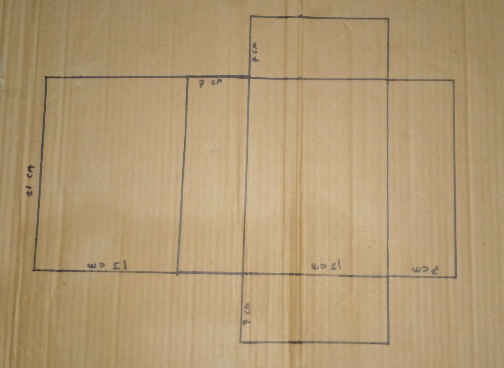

Balok ini memiliki panjang 21 cm, lebar 15 cm, dan tinggi 7 cm.

### 2. Potong setiap bagian sebanyak dua lembar

Jika kerangka sudah dibuat, potong setiap bagian menjadi dua lembar kardus. Kemudian rekatkan menggunakan lem tembak supaya kekuatan kardus tidak terlalu lemah.

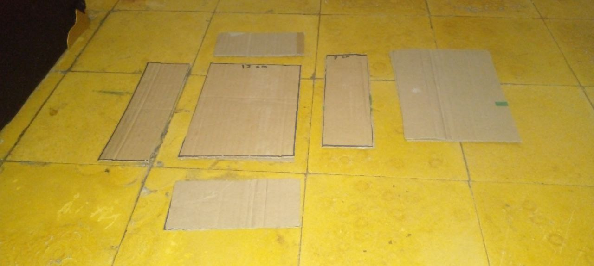

### 3. Mengatur jarak antar tombol

Untuk penempatan tombol, gunakan jaring-jaring balok dari kardus yang sudah dibuat menggunakan bagian tutup balok.

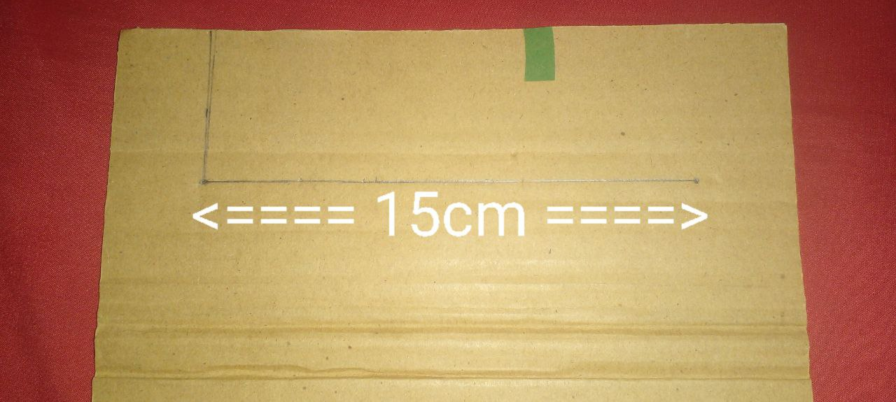

Panjang keseluruhan peletakan tombol itu 15cm untuk tombol kandidat dan aksi pilih dan pembatalan.

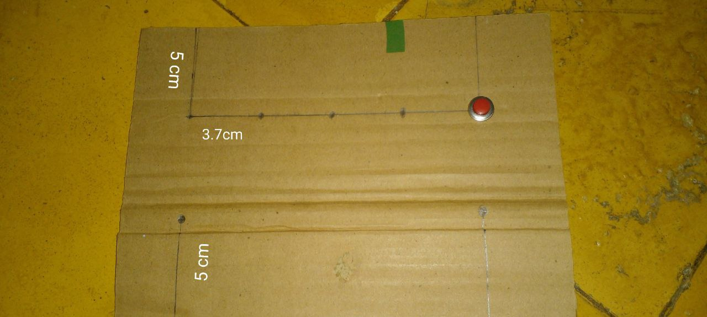

Untuk tombol angka yang nantinya digunakan untuk memilih kandidat, beri jarak 5cm dari atas juga 3 cm dari kanan dan kiri. Jarak antar tombol memiliki panjang 3.7cm supaya sesuai.

Tombol batal dan pilih juga beri jarak dari bawah. Tombol batal mengikuti posisi tombol nomor 1, sedangkan tombol pilih mengikuti posisi tombol nomor 5.

Tombol reload diposisikan sejajar dengan tombol nomor 5, posisi berjarak 3 cm dari kiri, 3.5 cm dari atas.

Jika sudah pasang lubangi titik-titik yang sudah dibuat, lalu pasang tombol yang sebelumnya sudah disiapkan. Kurang lebih hasilnya akan seperti ini.

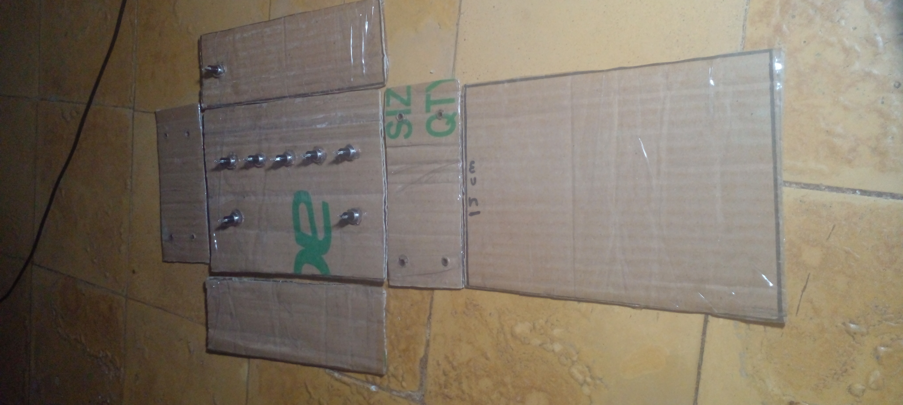

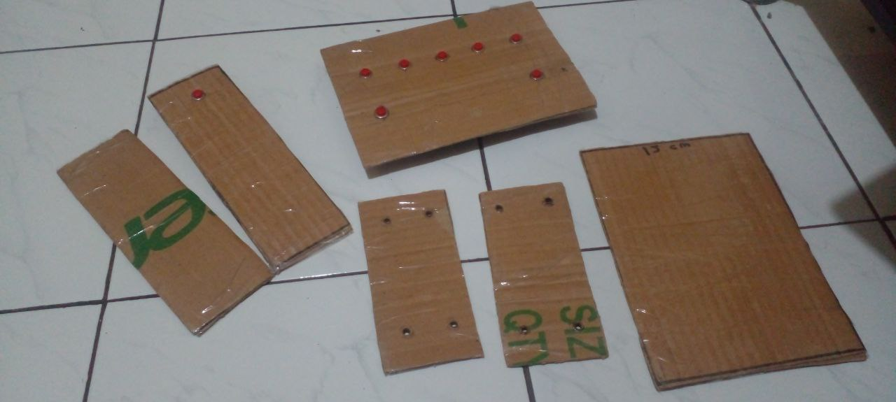

> Jika memperhatikan gambar di atas ada 4 lubang di dua sisi kanan dan kiri kardus, itu berfungsi sebagai lubang udara. Ini opsional tetapi

### 4. Merancang sirkuit

Desain tombol ini sangat berdasar pada artikel [makeuseof.com](https://www.makeuseof.com/tag/make-custom-shortcut-buttons-arduino/) yang membahas cara membuat tombol sendiri. Kurang lebih gambar sirkuitnya sama, yang membedakan saya hanya menggunakan D2 sampai D9 saja.


Gambar di atas merupakan gambaran dasar sirkuitnya. Jika diperhatikan pin D2 sampai D9 menggunakan transistor 10k ohm yang warna emas terhubung ke pin arduino, sedangkan seluruh resisto warna coklat akan tersambung ke pin ground atau `GND`.


Gambar di atas adalah versi yang nantinya akan digunakan.

### 5. Menambahkan kabel ke tombol dan lem tombol

Jika sudah merancang sirkuitnya, sekarang sambungkan kabel ke tombol dengan cara menyolder kabel supaya sambungannya kuat. Berlaku untuk semua tombol, kira-kira tampaknya akan terlihat seperti dua gambar dibawah ini.

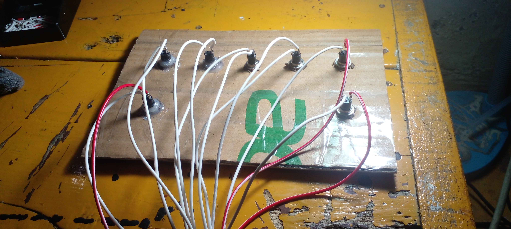

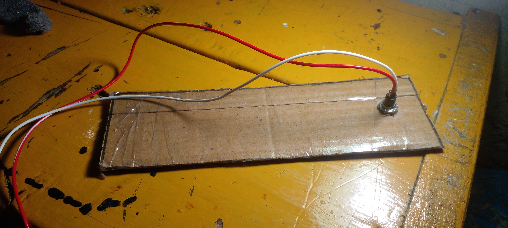

Jika sudah, lem semua tombol supaya tidak mudah lepas dari kardus. Hal ini juga dapat mengurangi kerusakan jika tombol ditekan terlalu keras.

### 6. Menyambungkan kabel ke sirkuit

Jika sudah menambahkan kabel ke tombol-tombol yang ada, saatnya menyambungkan tombol ke sirkuit yang sudah dibuat sebelumnya. `5V` terhubung ke satu sisi dari tombol, sisi yang lain akan terhubung ke digital pin dari arduino.

Jika berpatokan pada kode di bawah ini,

```ino
const int ESC_PIN = 4;
const int KEYBIND_1_PIN = 9;
const int KEYBIND_2_PIN = 8;
const int KEYBIND_3_PIN = 7;
const int KEYBIND_4_PIN = 6;
const int KEYBIND_5_PIN = 5;
const int ENTER_PIN = 3;
const int RELOAD_PIN = 2;
```

Maka

- Tombol 1 => Pin D9
- Tombol 2 => Pin D8
- Tombol 3 => Pin D7
- Tombol 4 => Pin D6
- Tombol 5 => Pin D5
- Tombol Escape (Kiri Bawah) => Pin D4
- Tombol Enter (Kanan Bawah) => Pin D3
- Tombol Reload (Sisi depan, bersamaan port usb) => Pin D2

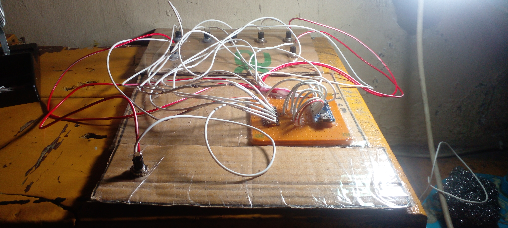

Gambar setelah di sambungkan menggunakan solder akan terlihat seperti ini.

> Sekali lagi, sesuaikan dengan kebutuhan

### 7. Memposisikan sirkuit dengan papan reload

Pada tahap ini, posisikan pcb dengan arduino yang sudah di rekatkan dengan kardus yang memiliki tombol reload. Disarkankan posisi yang bisa dipasang port mini usb ke arduino berada berseberangan dengan tombol reload. Jika sudah, buat lubang kotak untuk tempat terhubungnya arduino melalui USB.

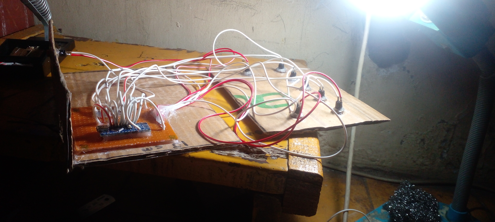

Tampak depan setelah dilubangi.

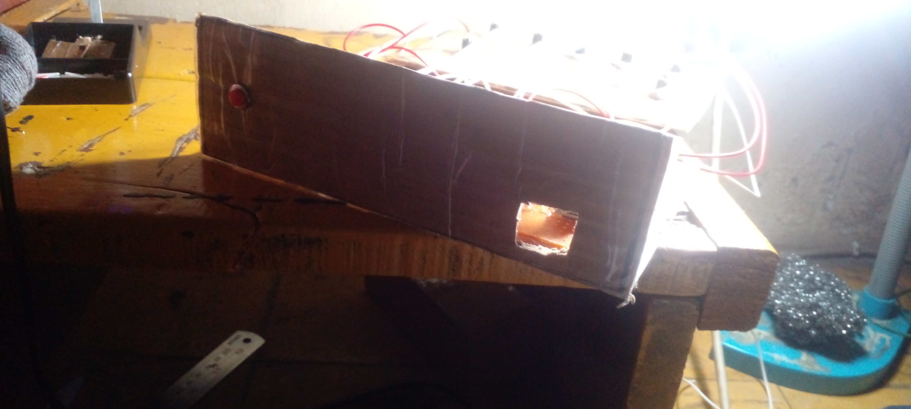

## Upload sketch ke arduino

TODO: penjelasan

## Sumber Lain

- https://www.makeuseof.com/tag/make-custom-shortcut-buttons-arduino/
